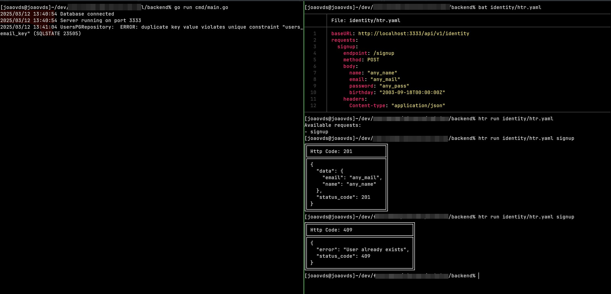

# HTR - HTTP Request Tool

HTR é uma ferramenta de linha de comando (CLI) construída em Golang para facilitar a execução de chamadas HTTP. A ferramenta permite definir múltiplas requisições em um arquivo de configuração e executá-las diretamente via terminal.

## Funcionalidades

- Defina múltiplas requisições HTTP em um arquivo de configuração.
- Execute qualquer requisição definida no arquivo de configuração através do terminal.
- Ao rodar a CLI sem especificar uma requisição, liste todas as opções disponíveis no arquivo de configuração.
- Suporte para métodos HTTP como GET, POST, PUT, DELETE, etc.
- A ferramenta é projetada para ser simples de usar e extensível.

<div style="display: flex;">
    
</div>

## Instalação

**Go:** 1.24.0

1. Clone o repositório:

   ```bash
   git clone https://github.com/joaovds/htr.git
   cd htr
   go mod tidy
   ```

2. Compile o projeto:

   ```bash
   go build -o htr .
   ```

3. Mova o binário para um diretório acessível no seu PATH (opcional):

   ```bash
   sudo mv htr /usr/local/bin/
   ```

## Uso

**Exibir todas as requisições disponíveis**
Para listar todas as requisições configuradas no arquivo, basta executar o comando:

```bash
htr run path/to/config.htr.yaml
```

**Executar uma requisição específica**
Para executar uma requisição, use o nome dela como argumento. Exemplo:

```bash
htr run path/to/htr.yaml signup
```

## Arquivo de Configuração

As requisições são definidas em um arquivo de configuração. O formato de exemplo para o arquivo htr.yml seria:

```yaml
baseURL: http://localhost:3333/api/v1
requests:
  signup:
    endpoint: /identity/signup
    method: POST
    body:
      name: "any_name"
      email: "any_mail"
      password: "any_pass"
    headers:
      Content-type: "application/json"
  ping-google:
    url: https://google.com
    method: GET
headers:
  Authentication: "Bearer token"
```

O arquivo de configuração pode estar em qualquer lugar, desde que, no momento que executar o comando "run", você passe o caminho a partir do diretório atual até o arquivo de configuração. O arquivo pode ter qualquer nome também, sendo necessário apenas ser um arquivo _yaml_ e seguir a estrutura indicada.

**Sobre a estrutura do arquivo:**

- Na raiz do arquivo, pode ser informado:
  - baseURL
  - requests
  - headers
- O _baseURL_, quando informado, será a url base utilizada nas requests, sendo sucedido pelo campo _endpoint_ da request
- Cada request pode indicar o endpoint de duas formas:
  - _endpoint_: será o valor que virá após o baseURL global para realizar a request
  - _url_ : é a url completa para onde deve ser feita a request
- Em requests, você deve primeiramente nomear cada request que será inserida. No exemplo, temos _signup_ e _ping-google_
- **Dentro da configuração de cada request:**
  - method: deve ser um verbo http; _GET_, _POST_, _PUT_, etc
  - body: quando for preciso enviar dados pelo body da requisição. Deve seguir a estrutura de escrita _yaml_. No exemplo, o body de signup seria equivalente em json a `{"name": "any_name", "email": "any_mail", "password": "any_pass"}`
  - headers: segue a estrutura chave:valor. Serão headers que irão somente nessa requisição.
- Sobre headers:
  - Pode ser passado de forma global, assim como baseURL. Na raiz do arquivo, defina em _headers_ os headers global
  - A estrutura segue chave:valor
  - Headers globais serão passados em todas as requisições definidas no arquivo; já os headers dentro de uma requisição específica, serão usados apenas na mesma

## Contribuição

Esse projeto surgiu na intenção de facilitar a documentação de endpoints e testes em desenvolvimento de apis. Ainda muita coisa pode ser melhorada e acrescentada. Se tens uma ideia de feature ou algum bug a reportar, crie uma issue e abra PRs, e ajude no desenvolvimento dessa ferramenta.
Deixe sua estrela no repositório, teste a ferramente, crie um fork. Todos são bem vindos!

## Futuro

Podemos implementar novas features, como novos params, adicionar descrições nas requests, retornar o tempo da requisição, etc.
Quem sabe adicionar os executáveis nos repositórios de distribuições linux para uma instalação rápida, etc
